# 🛍️ Flutter Store App

A beautiful and responsive **eCommerce Store App** built with **Flutter**, using **Bloc for state management**, and integrated with **Fake Store API**. The app supports product listing, search, categories, cart, favorites, and user authentication.

## 🚀 Features

- 🛒 Product listing from Fake Store API
- 🔍 Search and filter by category
- ❤️ Add/remove favorites with persistence
- 🛍️ Cart with quantity and total price
- 👤 Login with token storage
- 🔐 Profile with logout
- 💾 Persistent data using `SharedPreferences`
- ✨ Clean architecture and BLoC pattern
- 📱 Responsive UI using `flutter_screenutil`

## 📱 Screenshots

  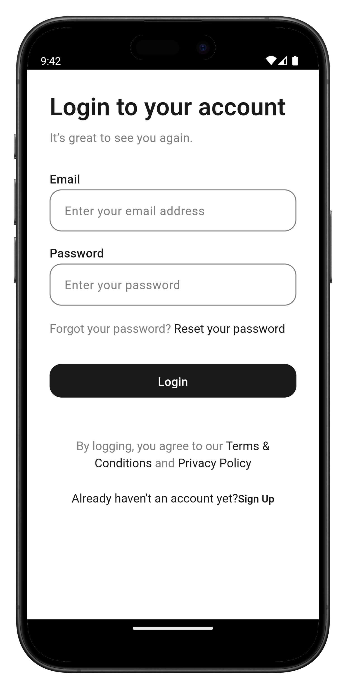
  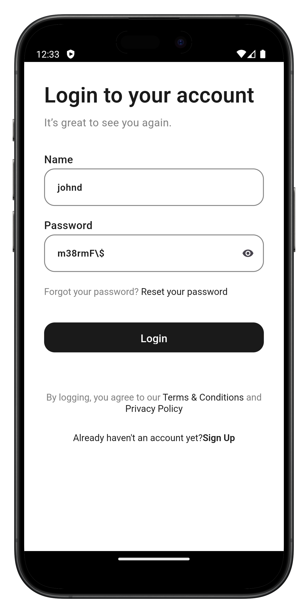
  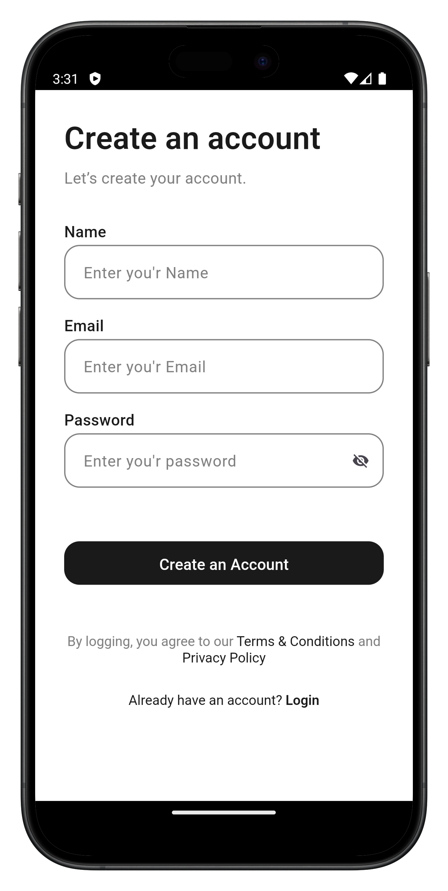
  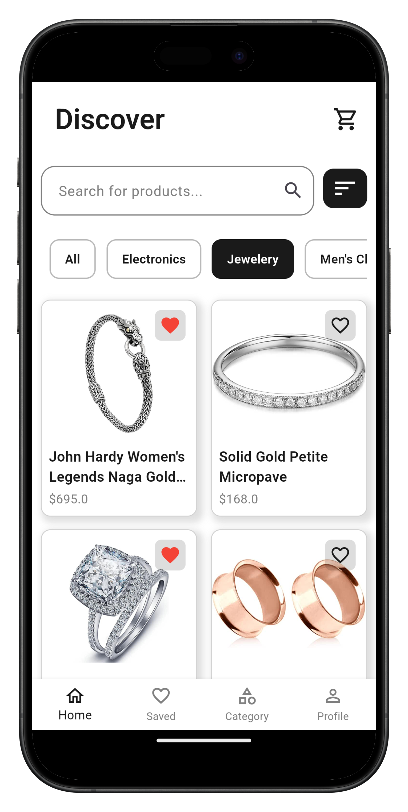
  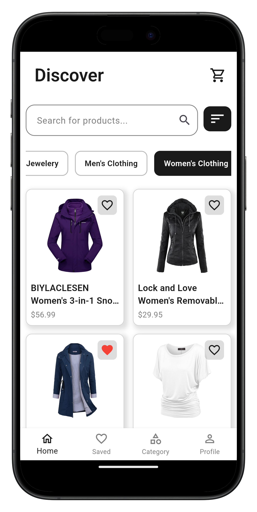
  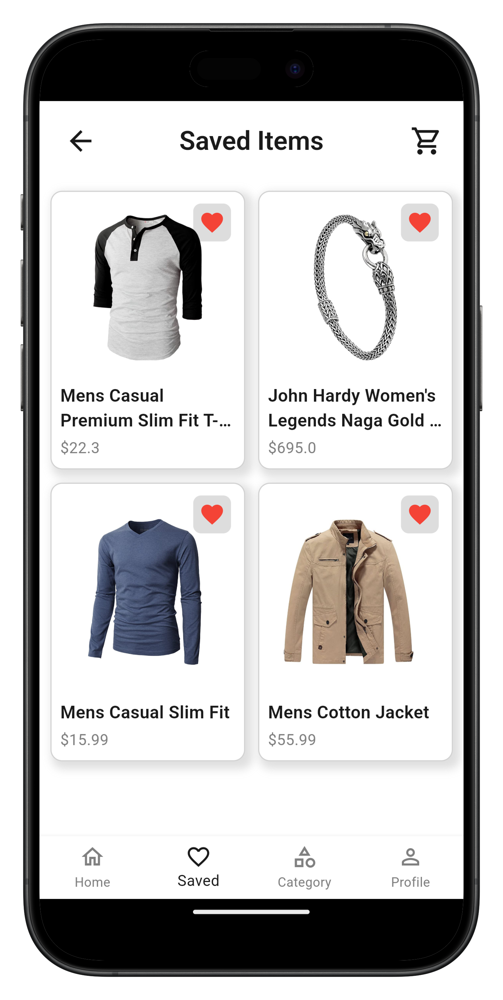
  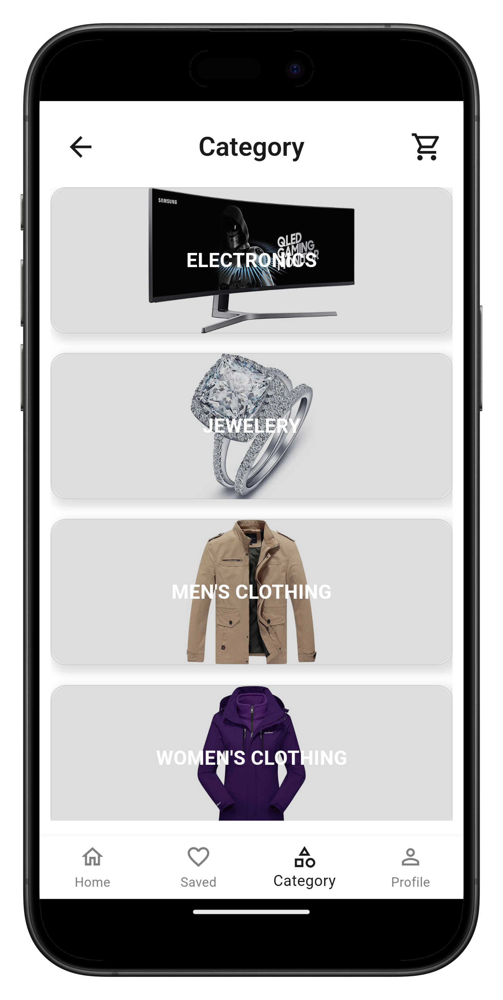
  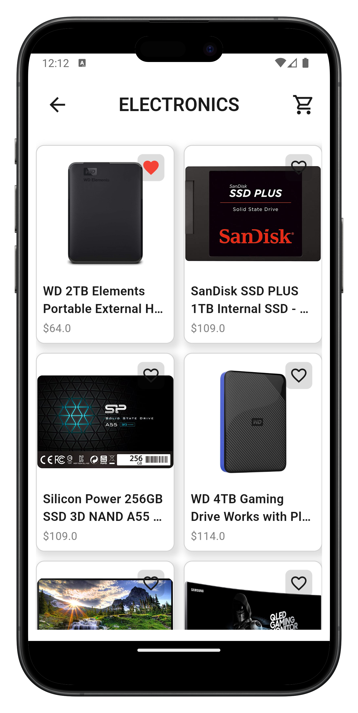
  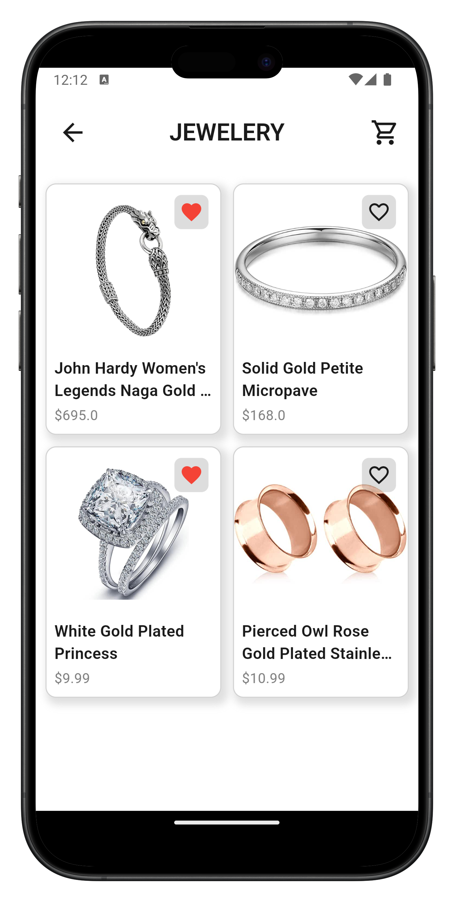
  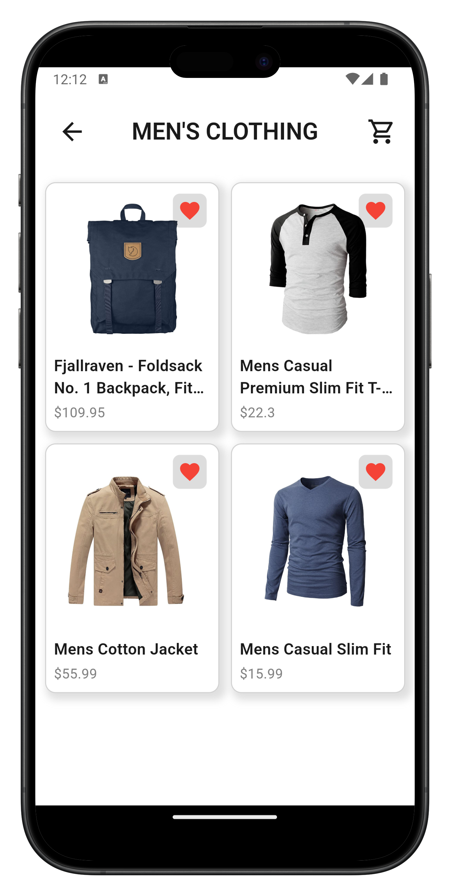
  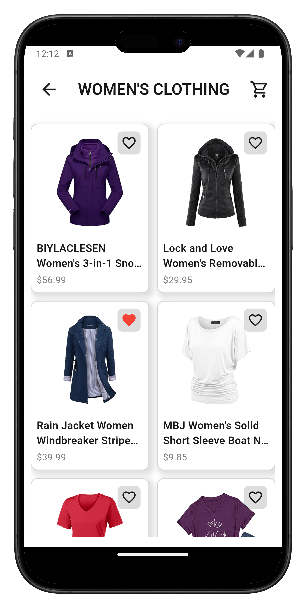
  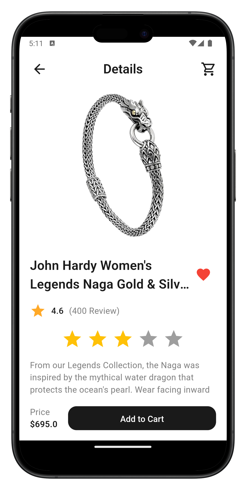
  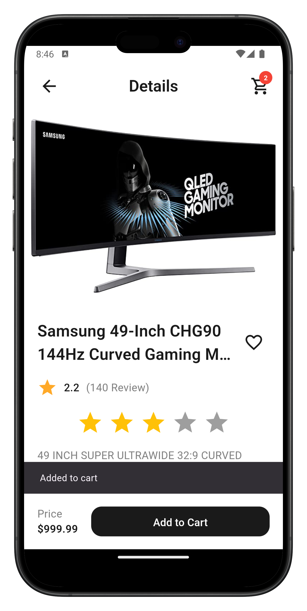
  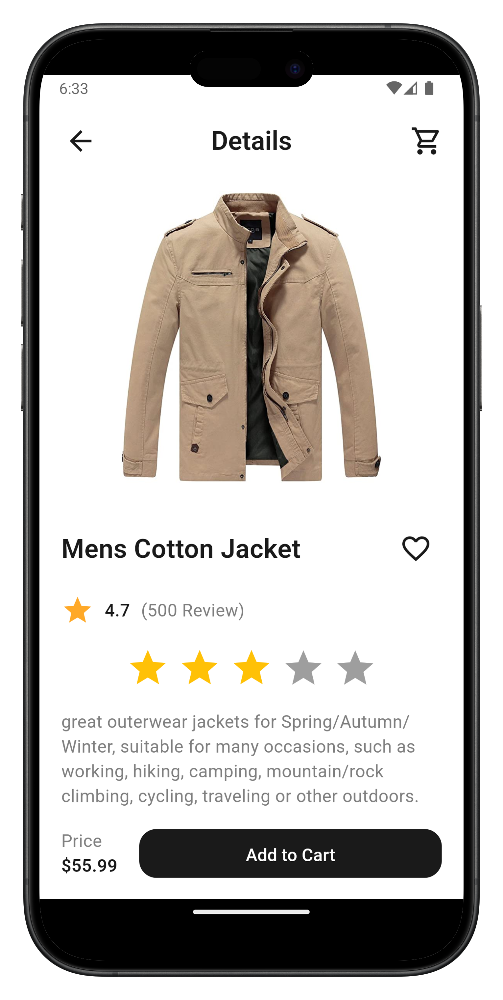
  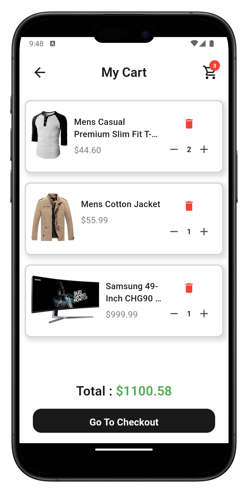
  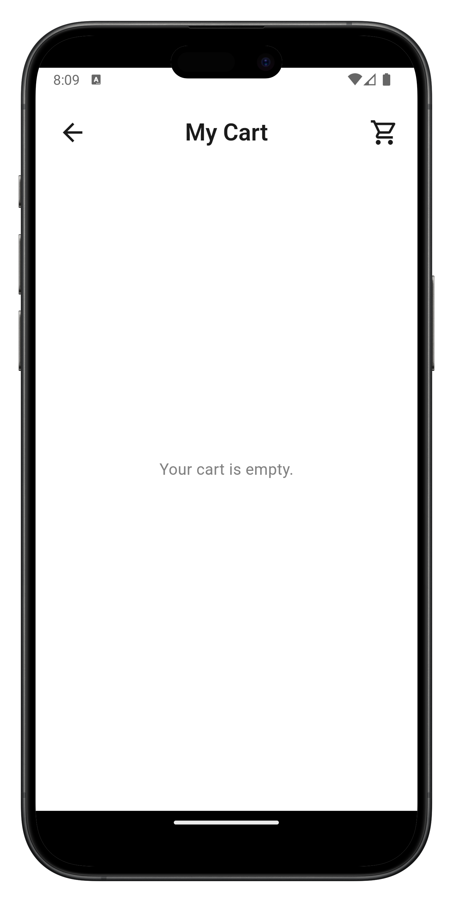
  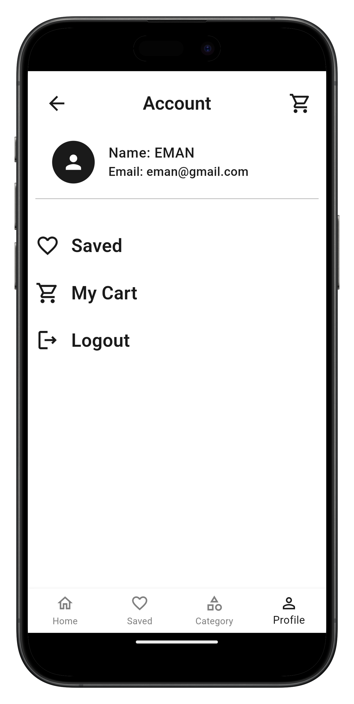
  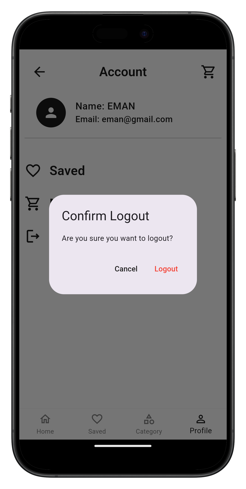  

## 🧱 Tech Stack

- **Flutter**
- **Bloc & Freezed**
- **Dio (network layer)**
- **SharedPreferences**
- **Fake Store API**: https://fakestoreapi.com/
- **Clean Architecture**

## 🛠️ Getting Started

